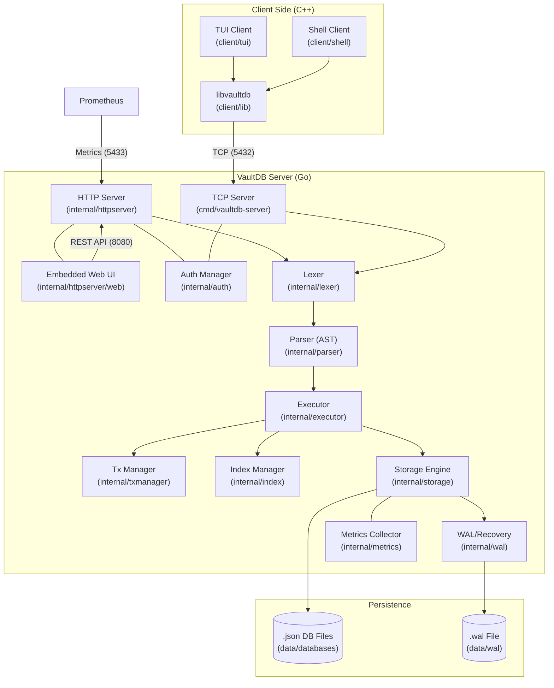

# VaultDB Architecture

This document provides a visual overview of the VaultDB system architecture.

## System Map

## Component Overview

### 1. Server (Go)
- **SQL Pipeline**: Lexer -> Parser -> Executor.
- **Query Support**:
  - Full relational algebra: SELECT, FROM, WHERE, JOIN (Nested Loop), GROUP BY, HAVING.
  - Sorting & Pagination: ORDER BY, LIMIT, OFFSET.
  - Aggregates: COUNT, SUM, AVG, MIN, MAX.
  - Set Operations: UNION (ALL), INTERSECT, EXCEPT.
  - Expressions: Arithmetic (+, -, *, /) and projection aliases.
- **Storage Engine**: JSON-based storage with versioned rows (Time Travel).
- **Transaction Management**: Optimistic Concurrency Control.
- **Reliability**: WAL (Write-Ahead Log) for crash recovery.

### 2. Clients (C++)
- **libvaultdb**: Communication layer for custom binary protocol.
- **TUI/Shell**: Interactive interfaces for database management.

### 3. Web UI
- Built with React/Vite, embedded into the Go binary.
- Communicates via REST API.

