# VaultDB Architecture

  

This document provides a visual overview of the VaultDB system architecture, reflecting the modular engine design and binary storage layer.

  

## System Map

```mermaid

graph TB

subgraph Client ["Client Side (C++)"]

TUI["TUI Client<br/>(client/tui)"]

Shell["Shell Client<br/>(client/shell)"]

Lib["libvaultdb<br/>(client/lib)"]

TUI --> Lib

Shell --> Lib

end

  

subgraph Server ["VaultDB Server (Go)"]

subgraph Net ["Networking & Security"]

HTTPSrv["HTTP Server<br/>(internal/httpserver)"]

TCPSrv["TCP Server<br/>(cmd/vaultdb-server)"]

TLS["TLS Provider<br/>(internal/tls)"]

RateLimit["Rate Limiter<br/>(internal/httpserver/ratelimit)"]

Auth["Auth Manager<br/>(internal/auth)"]

HTTPSrv --- RateLimit

HTTPSrv --- TLS

HTTPSrv --- Auth

TCPSrv --- TLS

TCPSrv --- Auth

end

  

WebUI["Embedded Web UI<br/>(internal/httpserver/web)"]

subgraph Core ["Core SQL Engine"]

subgraph Parser_Module ["Modular Parser"]

Parser["Parser Dispatcher"]

P_Select["SELECT Parser"]

P_DML["DML Parser (Ins/Upd/Del)"]

P_DDL["DDL Parser (Create/Drop)"]

Parser --- P_Select

Parser --- P_DML

Parser --- P_DDL

end

  

subgraph Executor_Module ["Modular Executor"]

Exec["Executor Engine"]

E_Select["SELECT Command"]

E_DML["DML Commands"]

E_DDL["DDL Commands"]

E_Eval["Expression Evaluator"]

E_Select --- E_Eval

Exec --- E_Select

Exec --- E_DML

Exec --- E_DDL

end

  

subgraph Evaluator ["Expression Engine"]

Eval["Eval Dispatcher"]

Ev_Func["Built-in Functions"]

Ev_Json["JSON/JSONB Logic"]

Ev_Time["DateTime Logic"]

Eval --- Ev_Func

Eval --- Ev_Json

Eval --- Ev_Time

end

  

Optimizer["Query Optimizer<br/>(internal/executor/optimizer)"]

Stats["Statistics<br/>(internal/executor/statistics)"]

TxMgr["Tx Manager<br/>(internal/txmanager)"]

Lexer["Lexer"] --> Parser

Parser --> Optimizer

Optimizer --- Stats

Optimizer --> Exec

Exec --- TxMgr

E_Eval --- Eval

end

  

subgraph StorageLayer ["Storage & Indexing"]

subgraph PageEngine ["Page Storage Engine"]

PE_Core["Engine Core"]

PE_IO["Low-level IO"]

PE_Index["Index Integration"]

PE_Alter["Alter/Rewrite Logic"]

PE_Vac["Vacuum Cleaner"]

PE_Core --- PE_IO

PE_Core --- PE_Index

PE_Core --- PE_Alter

PE_Core --- PE_Vac

end

BinEnc["Binary Encoding<br/>(internal/storage)"]

BufPool["Buffer Pool (LRU)"]

WAL["WAL/Recovery<br/>(internal/wal)"]

PE_IO --- BinEnc

PE_IO --- BufPool

PE_Core --> WAL

end

  

subgraph Utils ["Observability"]

Audit["Audit Logger"]

Metrics["Metrics Collector"]

end

  

HTTPSrv --- WebUI

Exec -.-> Audit

PageEngine --- Metrics

end

  

subgraph Data ["Persistence"]

HeapFiles[(".heap Files<br/>(data/pagedb)")]

WALFile[(".wal File<br/>(data/wal)")]

PE_IO --> HeapFiles

WAL --> WALFile

end

  

Lib -- "mTLS/TCP (5432)" --> TCPSrv

WebUI -- "REST API (8080)" --> HTTPSrv

```

  

  

## Component Overview

  

### 1. Modular SQL Pipeline

- **Lexer -> Modular Parser**: Hand-written recursive descent parser split into DDL, DML, and SELECT modules for maintainability.

- **Optimizer**: Cost-based optimizer using table statistics to choose between `SeqScan` and `IndexScan`.

- **Modular Executor**: Command-based execution engine. `SELECT` operations are decoupled into Join, Aggregate, and Window sub-modules.

- **Expression Evaluator**: Highly extensible engine supporting complex math, JSONB operations, and AI-powered semantic matching.

  

### 2. High-Performance Storage

- **Page Storage Engine**: ARIES-compliant storage using 8KB pages.

- **Binary Encoding**: Native binary serialization for rows, replacing legacy JSON storage for maximum throughput.

- **Buffer Pool**: LRU-based caching layer with page-level pinning to minimize disk I/O.

- **Indexing**: Integrated B-Tree, GIN (for JSONB/Full-text), and GiST indexes.

  

### 3. Reliability & Security

- **WAL (Write-Ahead Log)**: Streaming recovery mechanism with checksum validation and automatic corruption truncation.

- **Transaction Manager**: MVCC-inspired concurrency with conflict detection and isolation.

- **Security**: Mandatory mTLS for TCP, HMAC-SHA256 token authentication with constant-time comparison.

  

### 4. Clients & UI

- **C++ SDK**: `libvaultdb` for high-performance integration.

- **TUI & Shell**: Powerful interactive CLI tools.

- **Embedded Web UI**: React-based dashboard for real-time monitoring and query execution.