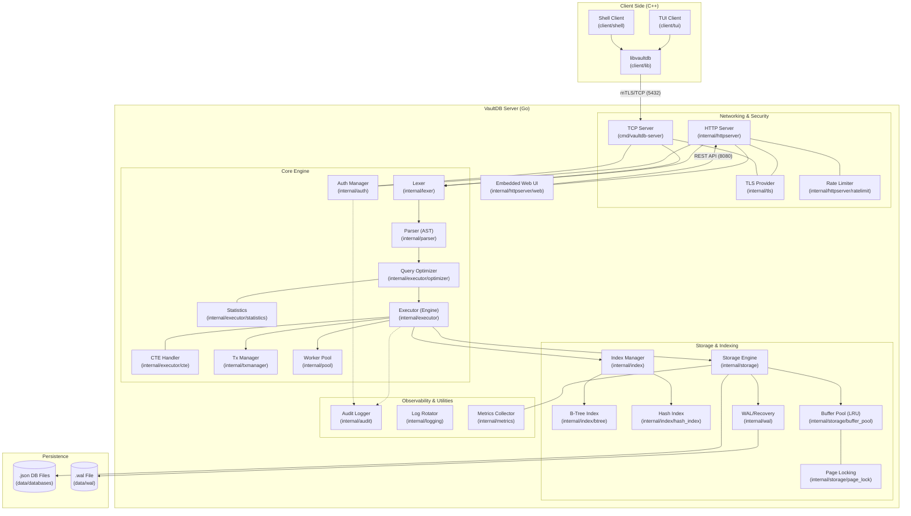

# VaultDB Architecture

This document provides a visual overview of the VaultDB system architecture, including the latest additions to the core engine and storage layers.

## System Map

## Component Overview

### 1. Server (Go)
- **SQL Pipeline**: Lexer -> Parser -> **Optimizer** -> Executor.
  - **Optimizer**: Implements cost-based decisions for access methods (SeqScan vs IndexScan) using table statistics.
  - **CTEs**: Support for Common Table Expressions and recursive queries.
- **Storage Engine**: JSON-based storage with versioned rows (Time Travel).
  - **Buffer Pool**: LRU caching layer for efficient page management and reduced disk I/O.
  - **Concurrency**: Page-level locking and optimistic concurrency control.
- **Indexing**: Support for both Hash and B-Tree indexes for efficient data retrieval.
- **Reliability**: WAL (Write-Ahead Log) for crash recovery.
- **Security**: Built-in mTLS support and API rate limiting.

### 2. Clients (C++)
- **libvaultdb**: Communication layer for custom binary protocol.
- **TUI/Shell**: Interactive interfaces for database management.

### 3. Web UI
- Built with React/Vite, embedded into the Go binary.
- Communicates via REST API.

### 4. Observability
- **Audit Logging**: Structured logging for DDL, DML, and Auth events.
- **Metrics**: Integration with Prometheus for real-time monitoring.
