# VaultDB Architecture

This document describes the architecture of VaultDB — a SQL database engine with a Go server and C++ client. It reflects the modular engine design, page-based binary storage layer, and all real modules in the codebase (verified against source tree).

---

## 1. Project Structure

```
├── server/                    # Go server
│   ├── cmd/
│   │   ├── vaultdb-server/    # Main server entry point
│   │   └── check-index/       # Index diagnostic tool
│   ├── internal/
│   │   ├── ai/                # AI embedding provider (SEMANTIC_MATCH/AI_EMBED)
│   │   ├── auth/              # HMAC-SHA256 token auth + rate limiter
│   │   ├── config/            # YAML + env config loader
│   │   ├── executor/          # Command-pattern execution engine
│   │   ├── httpserver/        # HTTP/REST + embedded Web UI + ratelimit
│   │   ├── index/             # B-Tree, GIN, GiST, Hash indexes
│   │   ├── lexer/             # Hand-written SQL lexer
│   │   ├── logging/           # Audit log with rotation
│   │   ├── metrics/           # Prometheus-style metrics collector
│   │   ├── parser/            # Recursive-descent SQL parser
│   │   ├── pool/              # Connection pool / tracker
│   │   ├── protocol/          # TCP request/response wire format
│   │   ├── storage/           # Page engine + binary encoding + buffer pool
│   │   ├── tls/               # TLS/mTLS config loader
│   │   ├── txmanager/         # MVCC transaction manager
│   │   ├── wal/               # Write-Ahead Log with ARIES recovery
│   │   └── websocket/         # WebSocket bridge for live queries
│   ├── vaultdb.go             # Embedded engine facade
│   ├── go.mod / go.sum
│   └── benchmark/             # Server-side benchmark suite
├── client/                    # C++ client
│   ├── lib/                   # libvaultdb shared library
│   │   ├── include/vaultdb/   # Public headers (connection, result, json_utils)
│   │   └── src/               # Implementation
│   ├── shell/                 # Interactive REPL shell
│   ├── tui/                   # Terminal UI (panel-based)
│   └── tests/                 # Client unit tests
├── tools/
│   └── benchmark/             # Go benchmark tool
├── data/                      # Runtime data directory
├── docs/                      # Documentation
├── build.sh / run.sh          # Build/run scripts
├── Dockerfile / docker-compose.yml
├── vaultdb.yaml / vaultdb.yaml.example
├── VERSION / Makefile
└── ARCHITECTURE.md            # ← this file
```

---

## 2. System Map

```mermaid
graph TB

  subgraph Client ["Client Side (C++)"]

    TUI["TUI Client<br/>(client/tui)"]
    Shell["Shell Client<br/>(client/shell)"]
    Lib["libvaultdb<br/>(client/lib)"]

    TUI --> Lib
    Shell --> Lib

  end

  subgraph Server ["VaultDB Server (Go)"]

    subgraph Net ["Networking & Security"]

      HTTPSrv["HTTP Server<br/>(internal/httpserver)"]
      TCPSrv["TCP Server<br/>(cmd/vaultdb-server)"]
      TLS["TLS Provider<br/>(internal/tls)"]
      RateLimit["Rate Limiter<br/>(internal/httpserver/ratelimit)"]
      Auth["Auth Manager<br/>(internal/auth)"]
      Proto["Wire Protocol<br/>(internal/protocol)"]
      ConnPool["Connection Pool<br/>(internal/pool)"]
      WS["WebSocket Bridge<br/>(internal/websocket)"]

      TCPSrv --- Proto
      TCPSrv --- Auth
      TCPSrv --- TLS
      TCPSrv --- ConnPool
      HTTPSrv --- RateLimit
      HTTPSrv --- TLS
      HTTPSrv --- Auth
      WS --- HTTPSrv

    end

    WebUI["Embedded Web UI<br/>(internal/httpserver/web)"]

    subgraph Core ["Core SQL Engine"]

      subgraph Parser_Module ["Parser"]

        Lexer["Hand-written Lexer<br/>(internal/lexer)"]
        Parser["Parser Dispatcher<br/>(internal/parser)"]
        P_Select["SELECT Parser"]
        P_DML["DML Parser<br/>(Ins/Upd/Del/Merge)"]
        P_DDL["DDL Parser<br/>(Create/Drop/Alter)"]
        P_Expr["Expression Parser"]

        Lexer --> Parser
        Parser --- P_Select
        Parser --- P_DML
        Parser --- P_DDL
        Parser --- P_Expr

      end

      subgraph Executor_Module ["Executor"]

        Exec["Executor Engine<br/>(internal/executor)"]
        E_Select["SELECT Command<br/>+ Join / Aggregate / Window"]
        E_DML["DML Commands<br/>(Insert/Update/Delete/Merge)"]
        E_DDL["DDL Commands<br/>(Create/Drop/Alter/Vacuum)"]
        E_Tx["Tx Commands<br/>(Begin/Commit/Rollback)"]
        E_SOp["Set Operations<br/>(Union/Intersect/Except)"]
        E_CTE["CTE / WITH<br/>(internal/executor/cte)"]
        E_Prep["Prepared Stmts<br/>(Prepare/Execute)"]

        Exec --- E_Select
        Exec --- E_DML
        Exec --- E_DDL
        Exec --- E_Tx
        Exec --- E_SOp
        Exec --- E_CTE
        Exec --- E_Prep

      end

      subgraph Evaluator ["Expression Engine"]

        Eval["Eval Dispatcher"]
        Ev_Func["Built-in Functions<br/>+ Math / String / Array"]
        Ev_Json["JSON / JSONB / FTS"]
        Ev_Time["DateTime Logic"]
        Ev_Like["LIKE / Pattern Match<br/>(internal/executor/like)"]
        Ev_Aggr["Aggregate Functions<br/>(Welford, Count, Sum)"]

        Eval --- Ev_Func
        Eval --- Ev_Json
        Eval --- Ev_Time
        Eval --- Ev_Like
        Eval --- Ev_Aggr

      end

      Optimizer["Query Optimizer<br/>(internal/executor/optimizer)"]
      Stats["Table Statistics<br/>(internal/executor/statistics)"]
      PlanCache["Plan Cache<br/>(internal/executor/plan_cache)"]
      ResCache["Result Cache<br/>(internal/executor/result_cache)"]
      BR["Live Query Broadcaster<br/>(internal/executor/broadcaster)"]

      Parser --> Optimizer
      Optimizer --- Stats
      Optimizer --> Exec
      Exec --- PlanCache
      Exec --- ResCache
      Exec --- BR

    end

    subgraph Evaluator2 ["Expression Engine (cont.)"]

      E_Eval["Expression Evaluator<br/>(internal/executor/eval)"]
      E_Eval_Ops["Operators (=, !=, <, >, IN, IS NULL)"]
      E_Eval_Func["Functions<br/>(COALESCE, CAST, CASE)"]
      E_Eval_Json["JSON Path/Operators<br/>(@>, <@, ?, ||)"]
      E_Eval_Subq["Subquery Exprs<br/>(ANY, ALL, EXISTS)"]

      E_Eval --- E_Eval_Ops
      E_Eval --- E_Eval_Func
      E_Eval --- E_Eval_Json
      E_Eval --- E_Eval_Subq

    end

    subgraph AI_Module ["AI & Semantic"]

      AI["AI Embedder<br/>(internal/ai)"]
      AI_ONNX["ONNX Runtime<br/>(optional provider)"]
      AI_HTTP["HTTP Embedding API<br/>(OpenAI-compatible)"]

      AI --- AI_ONNX
      AI --- AI_HTTP

    end

    TxMgr["Tx Manager<br/>(internal/txmanager)"]
    TxMgr --- Exec

    E_Eval --- Eval

    subgraph StorageLayer ["Storage & Indexing"]

      subgraph PageEngine ["Page Storage Engine<br/>(internal/storage)"]

        PE_Core["Engine Core<br/>(page_engine.go)"]
        PE_Tuple["Binary Tuple Encoding<br/>(binary_encoding.go)"]
        PE_Heap["Heap File Manager<br/>(internal/storage/heap)"]
        PE_Page["Page Data Structures<br/>(internal/storage/page)"]
        PE_FSM["Free Space Map<br/>(internal/storage/fsm)"]
        PE_IO["Low-level I/O<br/>(page_engine_io.go)"]
        PE_Index["Index Integration<br/>(page_engine_index.go)"]
        PE_Alter["Alter / Rewrite Logic<br/>(page_engine_alter.go)"]
        PE_Vac["Vacuum Cleaner<br/>(page_engine_vacuum.go)"]
        PE_Lock["Page Lock Manager<br/>(page_lock.go)"]

        PE_Core --- PE_Tuple
        PE_Core --- PE_Heap
        PE_Core --- PE_Page
        PE_Core --- PE_FSM
        PE_Core --- PE_IO
        PE_Core --- PE_Index
        PE_Core --- PE_Alter
        PE_Core --- PE_Vac
        PE_Core --- PE_Lock

      end

      BufPool["Buffer Pool (LRU)<br/>(buffer_pool.go)"]
      JSONDec["Legacy JSON Decoder<br/>(json_decode.go)"]
      Normalize["Name Normalizer<br/>(normalize.go)"]

      WAL["Write-Ahead Log<br/>(internal/wal)"]

      PE_IO --- BufPool
      PE_IO --- JSONDec
      PE_Core --> WAL

      subgraph Indexes ["Index Implementations<br/>(internal/index)"]

        BTree["B-Tree Index"]
        Gin["GIN Index<br/>(JSONB / Full-text)"]
        GiST["GiST Index<br/>(vector / geospatial)"]
        Hash["Hash Index"]
        Composite["Composite Index"]

        BTree --- Gin
        BTree --- GiST
        BTree --- Hash
        BTree --- Composite

      end

      PE_Index --- Indexes

    end

    subgraph Utils ["Observability & Infrastructure"]

      Audit["Audit Logger<br/>(internal/logging)"]
      Metrics["Metrics Collector<br/>(internal/metrics)"]
      Cfg["Config Loader<br/>(internal/config)"]

    end

    AI --- Exec
    HTTPSrv --- WebUI
    Exec -.-> Audit
    Exec -.-> Metrics
    PageEngine -.-> Metrics

  end

  subgraph Data ["Persistence"]

    HeapFiles[(".heap Files<br/>(data/pagedb/…/)")]
    WalFile[(".wal File<br/>(data/wal/vaultdb.wal)")]
    SchemaFile[("_schema.json<br/>(per table)")]
    CatalogFile[("_catalog.json<br/>(global)")]

    PE_Heap --> HeapFiles
    WAL --> WalFile
    PE_Core --- SchemaFile
    PE_Core --- CatalogFile

  end

  Lib -- "JSON-over-TCP (5432)" --> TCPSrv
  Lib -- "mTLS (optional)" --> TCPSrv
  WebUI -- "REST API (8080)" --> HTTPSrv
  WS -- "WebSocket (/ws)" --> HTTPSrv

```



---

## 3. Component Overview

### 3.1 SQL Pipeline (Lexer → Parser → Optimizer → Executor)

| Component | Package | Responsibility |
|-----------|---------|----------------|
| **Lexer** | `internal/lexer` | Hand-written rune-based tokenizer. Supports single-character operators (`=`, `!=`, `<`, `>`, `->`, `->>`, `@>`, `<@`, `?`, `||`), string escape sequences, negative number literals, `$N` param references. Returns line/col positions for error reporting. |
| **Parser** | `internal/parser` | Recursive-descent parser dispatching to modular sub-parsers (DDL, DML, SELECT, expressions). AST nodes for all statement types including CTE/WITH, MERGE, TRIGGER, VIEW, FUNCTION, PROCEDURE, WINDOW, SET operations, LAT ERAL subqueries. |
| **Optimizer** | `internal/executor/optimizer_*` | Cost-based optimizer. Uses table statistics (`internal/executor/statistics.go`) to choose between SeqScan and IndexScan. Supports predicate pushdown (`optimizer_pushdown.go`) and join ordering (`optimizer_join.go`). |
| **Executor** | `internal/executor` | Command-pattern execution. Each statement type maps to a `Command` via `reflect`-based registry (initialized in `init()`). Supports transactions, prepared statements, live query broadcasting, plan/result caching. |
| **Evaluator** | `internal/executor/eval*.go` | Expression evaluation engine with recursive descent. Handles math, string ops, JSONB operators, LIKE/FTS/Full-text, CASE/COALESCE/CAST, subqueries (ALL/ANY/EXISTS), window functions, aggregate functions (Welford online algorithm). |

### 3.2 Storage Layer

| Component | Package | Responsibility |
|-----------|---------|----------------|
| **Page Engine** | `internal/storage` | Full storage engine on top of page/heap layer. 16-byte tuple header (created_tx + deleted_tx LE uint64), JSON-encoded catalog with current TxID, last-modified tracking, row counts. |
| **Heap File** | `internal/storage/heap` | Low-level file manager: allocate/read/write 8KB pages. Pages are tracked in segments. Linked free page chain. |
| **Page** | `internal/storage/page` | Page data structures: header with check/compression flags, tuple slot array, tuple data area. |
| **FSM** | `internal/storage/fsm` | Free Space Map — tracks available space on pages for efficient INSERT placement. |
| **Binary Encoding** | `internal/storage/binary_encoding.go` | Compact binary row format: header + col-count + offset array + typed values. Type tags: `i` int64, `f` float64, `b` bool, `s` string, `j` JSONB, `v` float64 vector, 0xFF null. |
| **Buffer Pool** | `internal/storage/buffer_pool.go` | LRU-k page cache. Page pin/unpin with dirty tracking. Flush dirty pages up to a given LSN for checkpoint integration. |
| **JSON Decoder** | `internal/storage/json_decode.go` | Legacy JSON decoder for migration from JSON-based storage. |
| **Page Lock Manager** | `internal/storage/page_lock.go` | Per-page locking to coordinate concurrent access during DML. |

### 3.3 Indexes

| Type | File | Use Case |
|------|------|----------|
| **B-Tree** | `internal/index/btree.go` | Primary key and unique constraint indexes. Balanced tree with split/merge. |
| **GIN** | `internal/index/gin_index.go` | Generalized Inverted Index for JSONB paths and full-text search. |
| **GiST** | `internal/index/gist_index.go` | Generalized Search Tree for vector similarity and geospatial. |
| **Hash** | `internal/index/hash_index.go` | Hash index for exact-match equality lookups. |
| **Composite** | `internal/index/composite.go` | Multi-column index combining B-Tree entries. |
| **Manager** | `internal/index/manager.go` | Central index manager per table — coordinates index creation, lookup, and lifecycle. |

### 3.4 Transaction Manager

**Package**: `internal/txmanager`

MVCC-inspired transaction system:
- **Snapshot isolation**: each transaction records table versions at first access; Commit checks for conflicts.
- **Per-table commit locks**: serializes commits touching the same table.
- **Savepoints**: named markers within a transaction buffer with ROLLBACK TO support.
- **Spill-to-disk**: when `SpillThreshold` (default 10000) ops accumulate, pending operations are serialized to a file (avoids OOM on bulk operations).
- **Table version tracking**: atomic counters per table, bumped on every write.

### 3.5 Write-Ahead Log

**Package**: `internal/wal`

ARIES-inspired WAL with:
- **Fixed record format**: magic(4) + txID(8) + opType(1) + payloadLen(4) + payload + CRC32(4)
- **Operation types**: Insert/Update/Delete, Page operations (insert/delete/XMax), Schema writes, Full-page images, Rewrite (ALTER), Vacuum, Commit/Abort, Checkpoint
- **Three-phase recovery**: Analysis → Redo → Undo
- **Corruption resilience**: automatic truncation of corrupt tail with rename fallback
- **Batch fsync**: configurable `SyncBatchSize` (default 64) to amortize fsync cost
- **Full page images**: written before page modification to protect against torn pages

### 3.6 Networking & Security

| Component | Details |
|-----------|---------|
| **TCP Server** | `cmd/vaultdb-server/main.go` — JSON-over-TCP protocol on port 5432. Per-connection goroutine with rate limiter. |
| **HTTP Server** | `internal/httpserver` — REST API on port 8080 + health/monitor on port 5433. CORS configurable, request size limits. |
| **Wire Protocol** | `internal/protocol` — Request/Response JSON types shared between TCP and HTTP. |
| **Connection Pool** | `internal/pool` — Tracks active connections with max limit, idle cleanup, health-check. |
| **TLS/mTLS** | `internal/tls` — Loads TLS config with optional mTLS (CA verification). |
| **Auth** | `internal/auth` — HMAC-SHA256 token hashing with server secret. Per-IP rate limiter (token bucket) blocks after N failures in a window. |
| **WebSocket** | `internal/websocket` — WebSocket bridge for live query subscriptions over HTTP. |

### 3.7 AI / Semantic

**Package**: `internal/ai`

Pluggable embedding provider for `SEMANTIC_MATCH` and `AI_EMBED` SQL operations:
- **HTTP Embedder**: calls any OpenAI-compatible embedding API endpoint
- **Noop fallback**: when no provider configured, operations return a descriptive error instead of silently producing wrong results
- Injected into executor session via `SetEmbedder()`

### 3.8 Observability

| Component | Package | Details |
|-----------|---------|---------|
| **Metrics** | `internal/metrics` | Query counters (by type/status), connection counters, active connections, storage row counts. Background updater syncs metrics every 30s. |
| **Audit Log** | `internal/logging` | Structured audit log with file rotation. Tracks query execution and schema changes. |
| **Config** | `internal/config` | Hierarchical YAML config with env overrides. Validates all fields including port ranges, known values, and conflict detection. |

### 3.9 Clients

- **libvaultdb** (`client/lib`): C++17 shared library. OpenSSL-based TCP/TLS socket management, JSON request/response formatting. RAII connection, cross-platform (POSIX + Win32).
- **Shell** (`client/shell`): Interactive REPL with syntax highlighting and tab completion.
- **TUI** (`client/tui`): Panel-based terminal UI. Screens for database browser, query editor, table viewer, settings. Built with panel-based architecture (screens, components, dialogs).
- **Web UI** (`internal/httpserver/web`): Embedded React dashboard for real-time monitoring and query execution.

---

## 4. Internal Module Dependencies

```
cmd/vaultdb-server
  ├── internal/config
  ├── internal/storage (engine)
  │     ├── internal/storage/heap
  │     ├── internal/storage/page
  │     ├── internal/storage/fsm
  │     ├── internal/wal
  │     ├── internal/txmanager
  │     └── internal/index
  ├── internal/lexer
  ├── internal/parser
  ├── internal/executor
  │     ├── internal/metrics
  │     ├── internal/ai
  │     ├── internal/wal
  │     ├── internal/txmanager
  │     └── internal/storage
  ├── internal/httpserver
  │     ├── internal/websocket
  │     └── web/ (embedded)
  ├── internal/pool
  ├── internal/protocol
  ├── internal/auth
  ├── internal/tls
  └── internal/logging
```

Layer isolation (from high to low):
```
Client (C++) → TCP/HTTP → Auth → Parser → Optimizer → Executor → Storage/WAL
```

No circular dependencies between packages.

---

## 5. Key Data Flows

### Query Execution (SELECT)
```
SQL String
  → Lexer.NextToken() * N → []Token
  → Parser.Parse() → AST (SelectStatement)
  → Optimizer.FormatPlan() → Plan
  → Executor.Run() → Command.Execute()
     → Storage.SelectRows() / IndexLookup()
     → Evaluator.Eval() for WHERE/HAVING/ORDER BY
     → Result (Columns + Rows)
```

### Write Transaction (INSERT/UPDATE/DELETE)
```
SQL
  → Parser → AST
  → TxManager.Begin() → Transaction
  → For each row:
       WAL.Append(OpPageInsert, payload)  ← before page modification
       BufferPool.PinPage(pid)
       Page.InsertTuple(data)
       BufferPool.UnpinPage(pid, dirty=true)
  → TxManager.Commit()
       LockTables()
       Check snapshot versions for conflicts
       Apply ops to storage
       WAL.Append(OpCommit)
       Release locks
  → On crash recovery:
       WAL.AnalyzeTransactions() → committed / in-progress
       WAL.Replay() → redo all
       WAL.ReplayTransaction(xid) → undo in-progress
```

### Checkpoint Cycle (every 30s)
```
PageStorageEngine.CheckpointLoop()
  → WAL.Flush() (fsync)
  → BufferPool.FlushDirtyPagesUpToLSN()
  → saveCatalogLocked()
  → WAL.Append(OpCheckpoint)
  → WAL.Checkpoint() (truncate)
```

---

## 6. Code Statistics

| Measure | Count (approx.) |
|---------|----------------|
| Go packages | 18 internal + 2 cmd |
| Go source files | ~90 |
| Go test files | ~50 |
| C++ source files | ~25 |
| Lines of Go code | ~25,000 |
| Lines of C++ code | ~5,000 |
| Test files with fixtures | 10+ packages |

---

## 7. Architecture Decisions & Known Issues

### 7.1 Design Decisions

| Decision | Rationale |
|----------|-----------|
| **Command pattern via `reflect`** | Flexible statement→command mapping, but registration must be explicit in `init()`. Missing registration detected only at runtime. |
| **Binary tuple format** | 16-byte fixed header (created_tx + deleted_tx) enables in-place versioning and efficient vacuum. Offset array allows O(1) column access. |
| **Batch WAL fsync** | Default sync every 64 writes trades a small window of potential data loss for ~10-50x throughput improvement on write-heavy workloads. |
| **Page engine + WAL ownership** | Page engine owns both the heap storage and the WAL. This enables ARIES-style recovery where WAL replay directly modifies pages. |
| **Connection pool as counter** | Pool effectively tracks max concurrent connections rather than reusing idle ones. Each connection gets its own goroutine. |

### 7.2 Known Architecture Gaps

Identified during code audit — see `audit.md` for full details:

| Issue | Priority | Description |
|-------|----------|-------------|
| Lock ordering WAL↔PageEngine | Critical | `doCheckpoint()` takes `mu` then `wal.mu`; recovery callbacks take `wal.mu` then `mu`. Currently safe (non-concurrent), but fragile. |
| Context.Background() in executor | High | Query timeouts use `context.Background()` instead of server shutdown context — long queries aren't cancelled on graceful shutdown. |
| WAL silent error swallowing | High | Corrupt WAL entries in the middle of the file cause all subsequent valid entries to be silently lost. |
| getTableForRead/Write duplication | Medium | ~45 lines duplicated between read/write variants, differing only in `RLock` vs `Lock`. |

---

## 8. Extending VaultDB

### Adding a new statement type
1. Define AST node in `internal/parser/ast.go`
2. Add parsing in the appropriate `parse_*.go`
3. Register command in `internal/executor/executor.go` `init()`
4. Implement `Command` interface (`.Execute()`)
5. Add tests in `internal/executor/commands_*.go` and `parser_test.go`

### Adding a new index type
1. Implement the index in `internal/index/<type>.go`
2. Wire it into `internal/index/manager.go`
3. Add WAL operation type in `internal/wal/wal.go`
4. Integrate in `internal/storage/page_engine_index.go`

### Adding a new storage engine
1. Implement `storage.StorageEngine` interface (composes `ReadOnlyEngine` + `WriteEngine` + `AdminEngine`)
2. Register in `internal/config/config.go` validation (optional)
3. Wire in `cmd/vaultdb-server/main.go` `setupStorage()`
